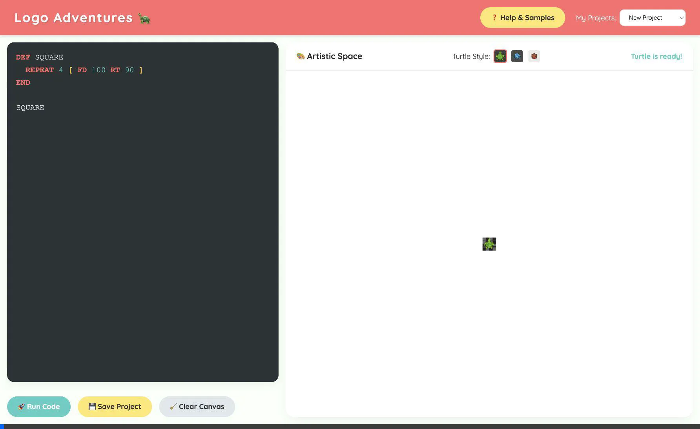
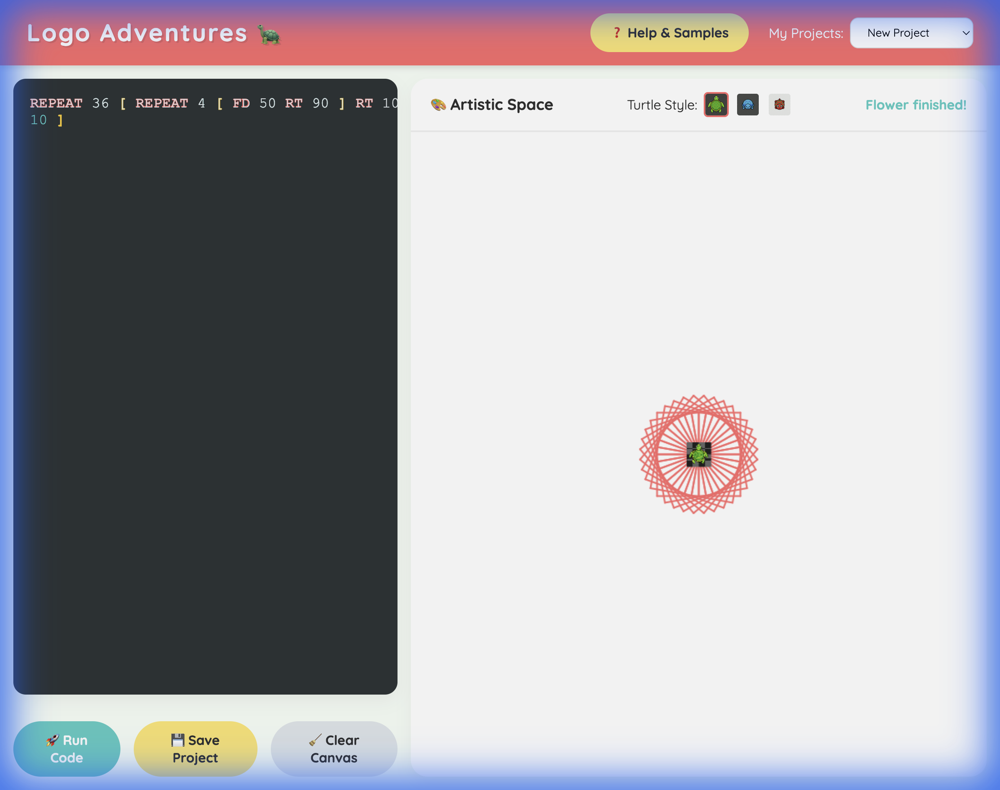
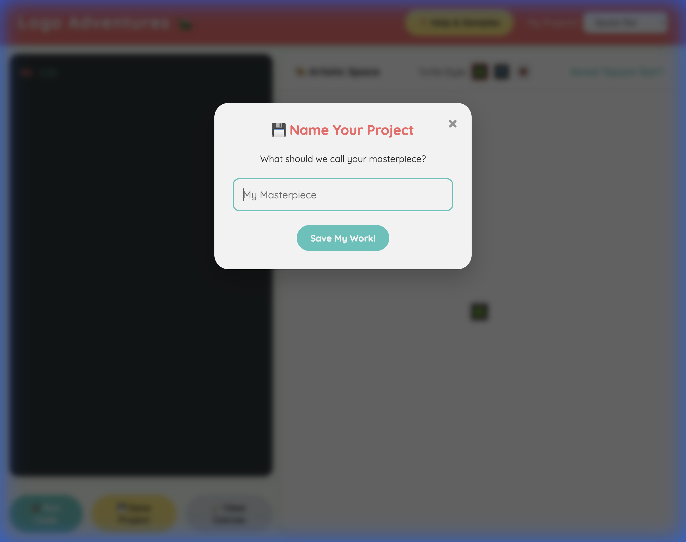

# 🐢 Logo Adventures: Coding for Kids!

A colorful, interactive, and educational Logo programming environment built with vanilla JavaScript. Perfect for kids to learn logic, geometry, and the joy of creating art through code.



## ✨ What's Inside?

### 🎨 Artistic Freedom
Draw anything from simple squares to complex geometric flowers using intuitive commands.


### 🦎 Customizable Turtles
Pick your favorite turtle companion! Switch between Green, Blue, or Red sprites that rotate and move exactly as you code.

### ❓ Interactive Help & Samples
Not sure where to start? Click the **Help & Samples** button to see a list of commands or click on an "Inspiring Sample" to watch the turtle draw it automatically!

### 💾 Stable Save Experience
We've replaced native pop-ups with a custom **Save Modal**! It's reliable, easy to use, and works perfectly in all browsers. No more looping dialogs or security errors.


---

## 🚀 Quick Start

1. **Open** `index.html` in your favorite browser.
2. **Type** some code:
   ```logo
   REPEAT 36 [
     FORWARD 100
     RIGHT 170
   ]
   ```
3. **Run** and watch the magic happen!

---
*Built with ❤️ for the next generation of creators.*
